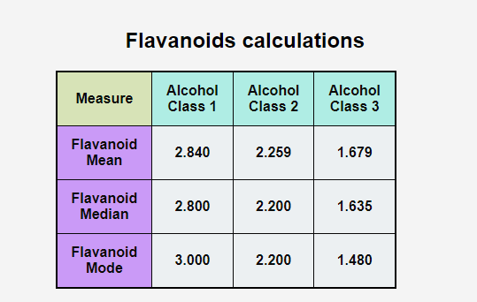
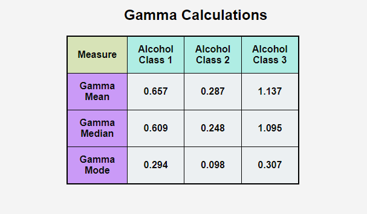
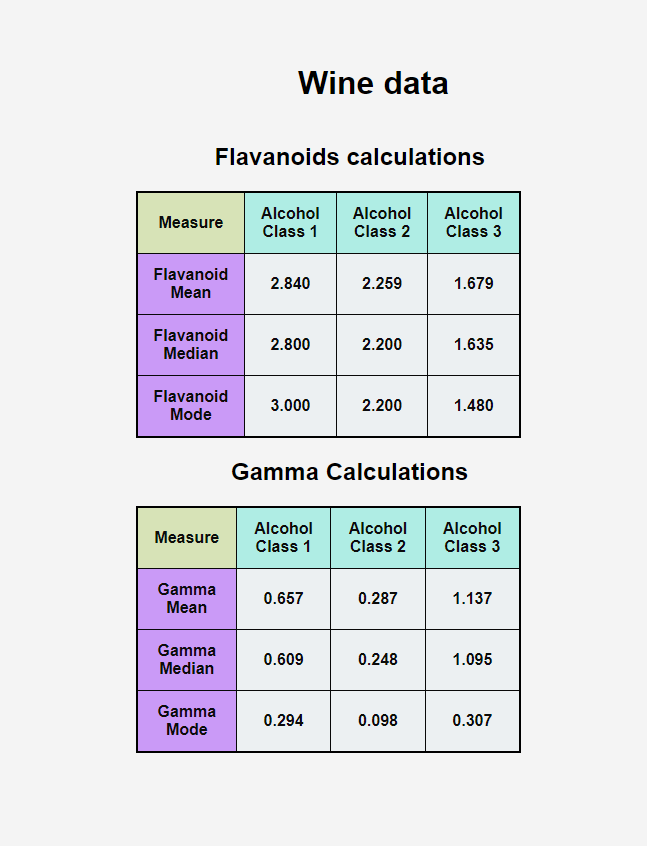

 

# Wine Data Web App

This web application analyzes wine data and calculates various statistics of different data
## Prerequisites
- Node.js and Yarn should be installed on your system. You can download and install Node.js from [here](https://nodejs.org/) and Yarn from [here](https://classic.yarnpkg.com/).

## Getting Started
1. Clone this repository to your local machine:

git clone https://github.com/prangya-parimita-patra/winedata.git

2.install project dependencies using yarn:
    `yarn install`

## Available Scripts

In the project directory, you can run:

### `yarn start`

Runs the app in the development mode.\
Open [http://localhost:3000](http://localhost:3000) to view it in the browser.

The page will reload if you make edits.\
You will also see any lint errors in the console.

### `yarn test`

Launches the test runner in the interactive watch mode.\
See the section about [running tests](https://facebook.github.io/create-react-app/docs/running-tests) for more information.

### `yarn build`

Builds the app for production to the `build` folder.\
It correctly bundles React in production mode and optimizes the build for the best performance.

The build is minified and the filenames include the hashes.\
Your app is ready to be deployed!

